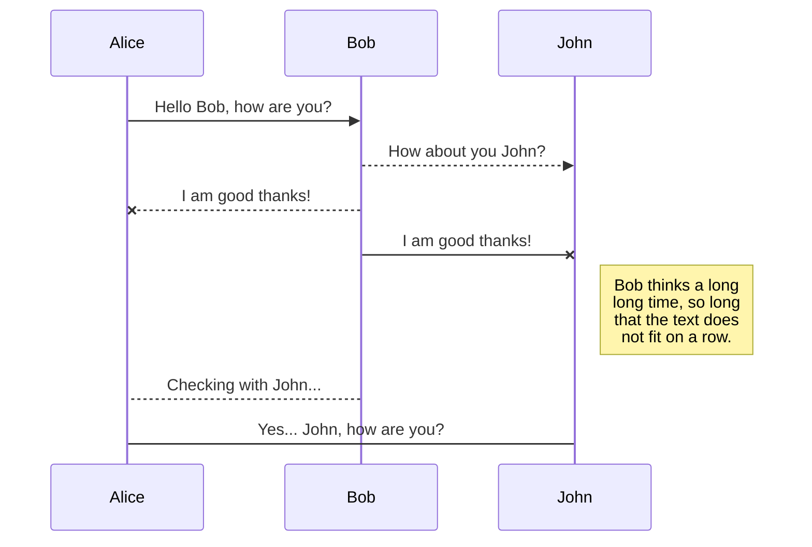
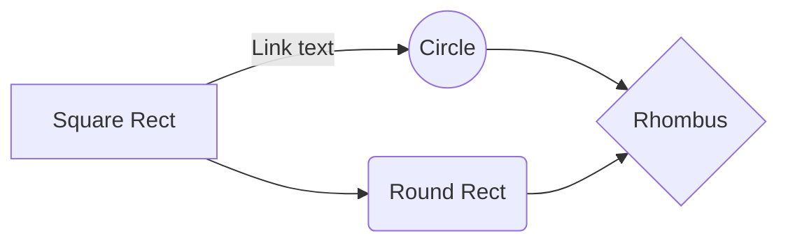

# DeepSafe 🐶
DeepFake Detection made easy

DeepSafe consists of 3 tools.
1. WebApp - The webapp has 2 modes. The one live on GCP is limited to one model each for image and video deepfake detection and the other one consists of multiple detector which the users can choose from a drop down. The later comes with a lot of rich features out of box designed so that users can add their own custom detectors and use all the existing ones out-of-the-box with minimal changes.
2. DeepSafe API - This is an API written in Flask which returns the probability of an image being a deepfake in json.
3. Chrome Extension - This extension works right out of the browser to help identify any video the user is watching on the internet. Currently, it redirects the user to the DeepSafe webapp with the current URL.

# WebApp - [Live here](https://deepsafe-75twwvyl5q-de.a.run.app)
This is a limited access app, for the full access please [contact me](mailto:siddharth123sk@gmail.com).

1. Clone the repository:
```bash
git clone https://github.com/siddharthksah/DeepSafe
cd DeepSafe
```

Python version
---
> Main supported version : <strong>3.8</strong> <br>
> Other supported versions : <strong>3.7</strong> & <strong>3.9</strong>
---
2. Creating conda environment

```bash
conda create -n deepsafe python==3.8 -y
conda activate deepsafe
```

3. Install dependencies:
```bash
pip install -r requirements.txt
```

4. Download Model Weights

| Service | Google Drive  | Mega Drive  |
| :---:   | :-: | :-: |
  | Link | [Google Drive](https://drive.google.com/drive/folders/1Gan21zLaPD0wHbNF3P3a7BzgKE91BOpq?usp=sharing) | [Mega Drive](https://mega.nz/folder/faxWBbID#B84oIE9VEw2FvV8dEVW1XQ) |
  
The weights can be downloaded [Gdown](https://github.com/wkentaro/gdown) as well if these drives are inaccessible in your area.

How to use Gdown
 ---
### Installation

```bash
pip install gdown
# to upgrade
pip install --upgrade gdown
```
```python
import gdown

#this takes a while cause the folder is quite big about 3.4G

url = "https://drive.google.com/drive/folders/1Gan21zLaPD0wHbNF3P3a7BzgKE91BOpq?usp=sharing

gdown.download_folder(url, quiet=True, use_cookies=False)
```
  ---
  


5. Starting the application:
```bash
streamlit run main.py
```
---
### Dockerize the webapp

[Container on Docker Hub](https://hub.docker.com/repository/docker/siddharth123sk/deepsafe)

```dockerfile
#Base Image to use
FROM python:3.7.9-slim

#Expose port 8080
EXPOSE 8080

#Optional - install git to fetch packages directly from github
RUN apt-get update && apt-get install -y git
RUN apt-get install ffmpeg libsm6 libxext6  -y


#Copy Requirements.txt file into app directory
COPY requirements.txt app/requirements.txt

#install all requirements in requirements.txt
RUN pip install -r app/requirements.txt

#Copy all files in current directory into app directory
COPY . /app

#Change Working Directory to app directory
WORKDIR /app

#Run the application on port 8080
ENTRYPOINT ["streamlit", "run", "main.py", "--server.port=8080", "--server.address=0.0.0.0"]
```

Building the Docker Image
```
docker build -f Dockerfile -t app:latest .
```
Running the docker image and creating the container
```
docker run -p 8501:8501 app:latest
```
> You might need to use sudo before the docker commands if the user does not have admin privileges.
----
### Pushing the image to Docker Hub

After you made your own Docker image, you can sign up for an account on https://hub.docker.com/. After verifying your email you are ready to go and upload your first docker image.

1. Log in on https://hub.docker.com/
2. Click on Create Repository.
3. Choose a name (e.g. verse_gapminder) and a description for your repository and click Create.
4. Log into the Docker Hub from the command line

```bash
docker login --username=yourhubusername --email=youremail@company.com
```

just with your own user name and email that you used for the account. Enter your password when prompted. If everything worked you will get a message similar to
```
WARNING: login credentials saved in /home/username/.docker/config.json
Login Succeeded
```
Check the image ID using
```
docker images
```
and what you will see will be similar to

```
REPOSITORY              TAG       IMAGE ID         CREATED           SIZE
verse_gapminder_gsl     latest    023ab91c6291     3 minutes ago     1.975 GB
verse_gapminder         latest    bb38976d03cf     13 minutes ago    1.955 GB
rocker/verse            latest    0168d115f220     3 days ago        1.954 GB
```
and tag your image
```
docker tag bb38976d03cf yourhubusername/verse_gapminder:firsttry
```

The number must match the image ID and :firsttry is the tag. In general, a good choice for a tag is something that will help you understand what this container should be used in conjunction with, or what it represents. If this container contains the analysis for a paper, consider using that paper’s DOI or journal-issued serial number; if it’s meant for use with a particular version of a code or data version control repo, that’s a good choice too - whatever will help you understand what this particular image is intended for.

Push your image to the repository you created
```bash
docker push yourhubusername/verse_gapminder
```
----
----
## Deploying the WebApp on Google Cloud

### Build and deploy

Command to build the application. Please remember to change the project name and application name
```bash
gcloud builds submit --tag gcr.io/<ProjectName>/<AppName>  --project=<ProjectName>
```

Command to deploy the application
```bash
gcloud run deploy --image gcr.io/<ProjectName>/<AppName> --platform managed  --project=<ProjectName> --allow-unauthenticated
```
### If you are new to GCP - Follow the steps below -

##### Activate gcloud Command Line Tool and Push Local Image to GCP
To install the app on  Google Cloud, need to have account and gcloud tool installed in the system. 

Initiate GCloud
```bash
gcloud init
```
Set Project,Billing,  Service Account and Region and Zone example to set Region as Mumbai India...
```
gcloud config set compute/region asia-south1
gcloud config set compute/zone asia-south1-b
```
Enable Container Registry and Cloud Run Api run the following command in gcloud terminal
```
gcloud services enable run.googleapis.com containerregistry.googleapis.com
```

Push Local Image to GCP Cloud Container Registry. The following command will allow local docker engine to be used by gcloud tool.
> Quick note - Make sure to select the right google account if you are logging from the browser and you have multiple google accounts.
```
gcloud auth configure-docker
```
Following step will create a tag of the local image as per gcp requirment.
```
docker  tag st_demo:v1.0  gcr.io/< GCP PROJECT ID > /st_demo:v1.0
```
Push Local Image to GCP Registry
```
docker push gcr.io/< GCP PROJECT ID > /st_demo:v1.0
```

Finally ! Deploy on Serverless Cloud Run. Run the following Single Line command to deploy / host the app.  
```
gcloud run deploy < service name >  --image < gcp image name>   --platform managed --allow-unauthenticated --region < your region > --memory 2Gi --timeout=3600
```
Below are the arguments.
<pre>
< service name >          : Service Name User Supplied 
< gcp image name>         : Image Pushed into GCP 
< your region >           : Region was set at the Gcloud Init.
< platform managed >      : GCP Specific Parameter, consult GCP Manual for further details.
< allow-unauthenticated > : GCP Specific Parameter, consult GCP Manual for further details.
< memory >                : Memory to be allocated for the container deployment.
< timeout >               : GCP Specific Parameter, consult GCP Manual for further details. For streamlit deployment, this value should be set to a high value to avoid a timeout / connection error. 
</pre>

---
---

# DeepSafe Chrome Extension

**DeepSafe Chrome Extension** is a Chrome browser extension that provides easy access to the DeepSafe WebApp DeepFake Detection by one-click.

## Installation

Get a copy of the browser extension. Either clone the repository:

```bash
git clone https://github.com/siddharthksah/DeepSafe-API
```

or download the zip file.

Install the [unpacked extension in Chrome](https://webkul.com/blog/how-to-install-the-unpacked-extension-in-chrome/).

## Usage

Click on the browser extension icon (the dog emoji 🐶). It should open DeepSafe WebApp in a new tab.


## Contributing

Pull requests are welcome. For major changes, please open an issue first to discuss what you would like to change.

## License

Distributed under the [MIT License](https://choosealicense.com/licenses/mit/).

## Installation Guide

Follow the below steps to add the extension to your Google Chrome browser:

Open the Extension Manager by following:

1. Kebab menu(⋮) -> More Tools -> Extensions

2. If the developer mode is not turned on, turn it on by clicking the toggle in the top right corner

3. Download the extension file from here.

4. Extract the downloaded .zip file and note the extracted path

5. Now click on Load unpacked button on the top left and select the extracted folder

---
---

# DeepSafe API
A RESTful Flask API. DeepSafe-API combines the powerful features of the DeepSafe-WebApp into an API. DeepSafe WebApp is an open-source platform that integrates state-of-the-art DeepFake detection methods and provide a convenient interface for the users to compare their custom detectors against SOTA along with improving the literacy of DeepFakes among common folks.
### Overview

The code consists of both client and server side of the code. The image is saved locally before doing the inference, but you can delete the save location or even use the image on the fly.

The output is a json which consists the deepfake probability, were the probability closer to 1 means the model thinks it is a deepfake.

### Installation
1. Clone the repository:
```bash
git clone https://github.com/siddharthksah/DeepSafe
cd DeepSafe/DeepSafe-API/v1
```

Python version
---
> Main supported version : <strong>3.8</strong> <br>
> Other supported versions : <strong>3.7</strong> & <strong>3.9</strong>
---
2. Creating conda environment

```bash
conda create -n deepsafe-api python==3.8 -y
conda activate deepsafe-api
```

3. Install dependencies:
```bash
pip install -r requirements.txt
```

---
#### Code breakdown
Import and initialise your application:

```python
from flask_api import FlaskAPI

app = FlaskAPI(__name__)
```

## Responses

Return any valid response object as normal, or return a `list` or `dict`.

```python
@app.route('/example/')
def example():
    return {'hello': 'world'}
```

A renderer for the response data will be selected using content negotiation based on the client 'Accept' header. If you're making the API request from a regular client, this will default to a JSON response. If you're viewing the API in a browser, it'll default to the browsable API HTML.

## Requests

Access the parsed request data using `request.data`.  This will handle JSON or form data by default.

```python
@app.route('/example/')
def example():
    return {'request data': request.data}
```

## Example

The following example demonstrates a simple API for creating, listing, updating and deleting notes.

```python
from flask import request, url_for
from flask_api import FlaskAPI, status, exceptions

app = FlaskAPI(__name__)


notes = {
    0: 'do the shopping',
    1: 'build the codez',
    2: 'paint the door',
}

def note_repr(key):
    return {
        'url': request.host_url.rstrip('/') + url_for('notes_detail', key=key),
        'text': notes[key]
    }


@app.route("/", methods=['GET', 'POST'])
def notes_list():
    """
    List or create notes.
    """
    if request.method == 'POST':
        note = str(request.data.get('text', ''))
        idx = max(notes.keys()) + 1
        notes[idx] = note
        return note_repr(idx), status.HTTP_201_CREATED

    # request.method == 'GET'
    return [note_repr(idx) for idx in sorted(notes.keys())]


@app.route("/<int:key>/", methods=['GET', 'PUT', 'DELETE'])
def notes_detail(key):
    """
    Retrieve, update or delete note instances.
    """
    if request.method == 'PUT':
        note = str(request.data.get('text', ''))
        notes[key] = note
        return note_repr(key)

    elif request.method == 'DELETE':
        notes.pop(key, None)
        return '', status.HTTP_204_NO_CONTENT

    # request.method == 'GET'
    if key not in notes:
        raise exceptions.NotFound()
    return note_repr(key)


if __name__ == "__main__":
    app.run(debug=True)
```

Now run the webapp:

```shell
$ python ./example.py
 * Running on http://127.0.0.1:5000/
 * Restarting with reloader
```

You can now open a new tab and interact with the API from the command line:

```shell
$ curl -X GET http://127.0.0.1:5000/
[{"url": "http://127.0.0.1:5000/0/", "text": "do the shopping"},
 {"url": "http://127.0.0.1:5000/1/", "text": "build the codez"},
 {"url": "http://127.0.0.1:5000/2/", "text": "paint the door"}]

$ curl -X GET http://127.0.0.1:5000/1/
{"url": "http://127.0.0.1:5000/1/", "text": "build the codez"}

$ curl -X PUT http://127.0.0.1:5000/1/ -d text="flask api is teh awesomez"
{"url": "http://127.0.0.1:5000/1/", "text": "flask api is teh awesomez"}
```

You can also work on the API directly in your browser, by opening <http://127.0.0.1:5000/>.  You can then navigate between notes, and make `GET`, `PUT`, `POST` and `DELETE` API requests.

---
---
## DeepSafe API


### Server
```python
from flask import Flask, request, Response
import jsonpickle
import numpy as np
import cv2, os
from PIL import Image

import warnings
warnings.filterwarnings("ignore")

from predictor import predictor_CNN

# Initialize the Flask application
app = Flask(__name__)

# route http posts to this method
@app.route('/api_v1/', methods=['POST'])

def test():
    r = request
    # convert string of image data to uint8
    nparr = np.fromstring(r.data, np.uint8)
    # decode image
    img = cv2.imdecode(nparr, cv2.IMREAD_COLOR)
    #print(img)
    img = Image.fromarray(img)
    b, g, r = img.split()
    img = Image.merge("RGB", (r, g, b))
    if not os.path.exists('tempDir'):
        os.makedirs('tempDir')
    img.save('./tempDir/image.jpg', 'JPEG')

    #run prediction
    probab = predictor_CNN()

    response = {'Probability of DeepFake': probab}

    # encode response using jsonpickle
    response_pickled = jsonpickle.encode(response)

    return Response(response=response_pickled, status=200, mimetype="application/json")

# start flask app
app.run(host="0.0.0.0", port=5001)
```
### Client
```python
import requests
import json
import cv2
import os, shutil

addr = 'http://localhost:5001'
test_url = addr + '/api_v1/'

# prepare headers for http request
content_type = 'image/jpeg'
headers = {'content-type': content_type}
img = cv2.imread('tempDir/image.jpg')

# encode image as jpeg
_, img_encoded = cv2.imencode('.jpg', img)

# send http request with image and receive response
response = requests.post(test_url, data=img_encoded.tobytes(), headers=headers)

print(json.loads(response.text))
```

---
---
# Future Work

# Contributing
Any kind of enhancement or contribution is welcomed.


# Acknowledgments


[](http://makeapullrequest.com)


# Welcome to StackEdit!

Hi! I'm your first Markdown file in **StackEdit**. If you want to learn about StackEdit, you can read me. If you want to play with Markdown, you can edit me. Once you have finished with me, you can create new files by opening the **file explorer** on the left corner of the navigation bar.


# Files

StackEdit stores your files in your browser, which means all your files are automatically saved locally and are accessible **offline!**

## Create files and folders

The file explorer is accessible using the button in left corner of the navigation bar. You can create a new file by clicking the **New file** button in the file explorer. You can also create folders by clicking the **New folder** button.

## Switch to another file

All your files and folders are presented as a tree in the file explorer. You can switch from one to another by clicking a file in the tree.

## Rename a file

You can rename the current file by clicking the file name in the navigation bar or by clicking the **Rename** button in the file explorer.

## Delete a file

You can delete the current file by clicking the **Remove** button in the file explorer. The file will be moved into the **Trash** folder and automatically deleted after 7 days of inactivity.

## Export a file

You can export the current file by clicking **Export to disk** in the menu. You can choose to export the file as plain Markdown, as HTML using a Handlebars template or as a PDF.


# Synchronization

Synchronization is one of the biggest features of StackEdit. It enables you to synchronize any file in your workspace with other files stored in your **Google Drive**, your **Dropbox** and your **GitHub** accounts. This allows you to keep writing on other devices, collaborate with people you share the file with, integrate easily into your workflow... The synchronization mechanism takes place every minute in the background, downloading, merging, and uploading file modifications.

There are two types of synchronization and they can complement each other:

- The workspace synchronization will sync all your files, folders and settings automatically. This will allow you to fetch your workspace on any other device.
	> To start syncing your workspace, just sign in with Google in the menu.

- The file synchronization will keep one file of the workspace synced with one or multiple files in **Google Drive**, **Dropbox** or **GitHub**.
	> Before starting to sync files, you must link an account in the **Synchronize** sub-menu.

## Open a file

You can open a file from **Google Drive**, **Dropbox** or **GitHub** by opening the **Synchronize** sub-menu and clicking **Open from**. Once opened in the workspace, any modification in the file will be automatically synced.

## Save a file

You can save any file of the workspace to **Google Drive**, **Dropbox** or **GitHub** by opening the **Synchronize** sub-menu and clicking **Save on**. Even if a file in the workspace is already synced, you can save it to another location. StackEdit can sync one file with multiple locations and accounts.

## Synchronize a file

Once your file is linked to a synchronized location, StackEdit will periodically synchronize it by downloading/uploading any modification. A merge will be performed if necessary and conflicts will be resolved.

If you just have modified your file and you want to force syncing, click the **Synchronize now** button in the navigation bar.

> **Note:** The **Synchronize now** button is disabled if you have no file to synchronize.

## Manage file synchronization

Since one file can be synced with multiple locations, you can list and manage synchronized locations by clicking **File synchronization** in the **Synchronize** sub-menu. This allows you to list and remove synchronized locations that are linked to your file.


# Publication

Publishing in StackEdit makes it simple for you to publish online your files. Once you're happy with a file, you can publish it to different hosting platforms like **Blogger**, **Dropbox**, **Gist**, **GitHub**, **Google Drive**, **WordPress** and **Zendesk**. With [Handlebars templates](http://handlebarsjs.com/), you have full control over what you export.

> Before starting to publish, you must link an account in the **Publish** sub-menu.

## Publish a File

You can publish your file by opening the **Publish** sub-menu and by clicking **Publish to**. For some locations, you can choose between the following formats:

- Markdown: publish the Markdown text on a website that can interpret it (**GitHub** for instance),
- HTML: publish the file converted to HTML via a Handlebars template (on a blog for example).

## Update a publication

After publishing, StackEdit keeps your file linked to that publication which makes it easy for you to re-publish it. Once you have modified your file and you want to update your publication, click on the **Publish now** button in the navigation bar.

> **Note:** The **Publish now** button is disabled if your file has not been published yet.

## Manage file publication

Since one file can be published to multiple locations, you can list and manage publish locations by clicking **File publication** in the **Publish** sub-menu. This allows you to list and remove publication locations that are linked to your file.


# Markdown extensions

StackEdit extends the standard Markdown syntax by adding extra **Markdown extensions**, providing you with some nice features.

> **ProTip:** You can disable any **Markdown extension** in the **File properties** dialog.


## SmartyPants

SmartyPants converts ASCII punctuation characters into "smart" typographic punctuation HTML entities. For example:

|                |ASCII                          |HTML                         |
|----------------|-------------------------------|-----------------------------|
|Single backticks|`'Isn't this fun?'`            |'Isn't this fun?'            |
|Quotes          |`"Isn't this fun?"`            |"Isn't this fun?"            |
|Dashes          |`-- is en-dash, --- is em-dash`|-- is en-dash, --- is em-dash|


## KaTeX

You can render LaTeX mathematical expressions using [KaTeX](https://khan.github.io/KaTeX/):

The *Gamma function* satisfying $\Gamma(n) = (n-1)!\quad\forall n\in\mathbb N$ is via the Euler integral

$$
\Gamma(z) = \int_0^\infty t^{z-1}e^{-t}dt\,.
$$

> You can find more information about **LaTeX** mathematical expressions [here](http://meta.math.stackexchange.com/questions/5020/mathjax-basic-tutorial-and-quick-reference).


## UML diagrams

You can render UML diagrams using [Mermaid](https://mermaidjs.github.io/). For example, this will produce a sequence diagram:



And this will produce a flow chart:


