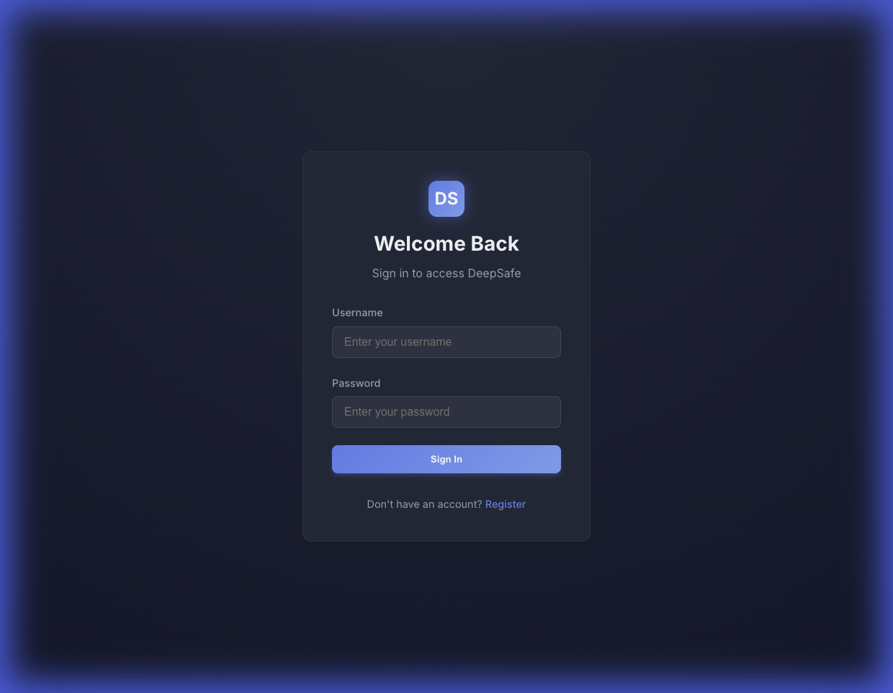
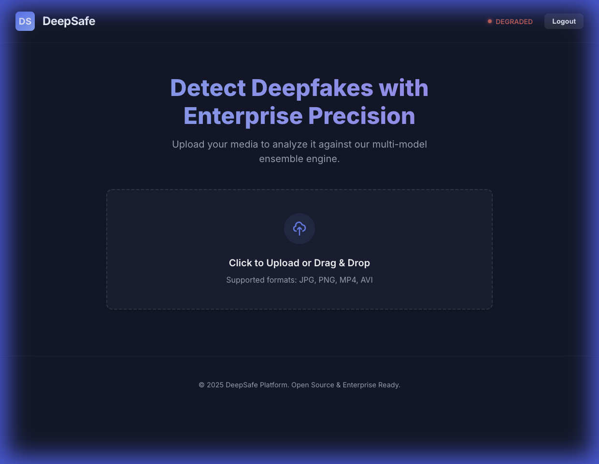
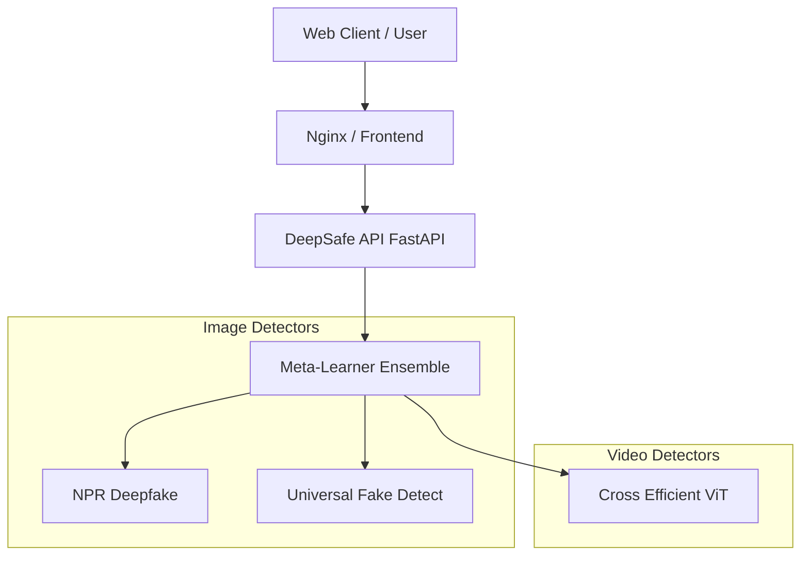

# DeepSafe: Enterprise-Grade Deepfake Detection Platform


<div align="center">

[](https://opensource.org/licenses/MIT)
[](https://github.com/siddharthksah/DeepSafe/actions)
[](https://www.python.org/downloads/release/python-390/)
[](https://www.docker.com/)

</div>

---

**DeepSafe** is a modular, high-performance, and containerized platform designed for the robust detection of deepfakes in digital media. By aggregating state-of-the-art detection models into a unified ensemble, DeepSafe provides enterprise-grade accuracy and reliability.

## 🚀 Why DeepSafe?

### Platform Agnostic & Dependency Isolated
DeepSafe adopts a **microservices architecture** where each detection model runs in its own isolated Docker container. This design choice is deliberate and critical:
-   **No Dependency Hell**: Each model can have its own specific version of PyTorch, CUDA, or other libraries without conflicting with others.
-   **Platform Independent**: Whether you are on Linux, macOS, or Windows, if you have Docker, DeepSafe works.
-   **Scalable**: Scale individual models based on load.

### Key Features
-   **Enterprise-Grade Authentication**: Secure Login and Registration system to protect access.
-   **Multi-Modal Detection**: Analyzes both **Images** and **Videos** for manipulation.
-   **Ensemble Intelligence**: Combines multiple state-of-the-art models (NPR, UniversalFakeDetect, CrossEfficientViT) for superior accuracy.
-   **Meta-Learning Engine**: Dynamically stacks model outputs using advanced meta-learners to reduce false positives.
-   **Premium UI/UX**: A modern, dark-themed React dashboard with interactive charts and real-time feedback.
-   **Dockerized Architecture**: Fully containerized services for easy deployment and isolation.
-   **RESTful API**: Robust FastAPI backend with health checks, batch processing, and detailed logging.

## 📸 UI Preview

<div align="center">
  
  
</div>

## 🏗️ Architecture

DeepSafe orchestrates a fleet of specialized detectors via a central API gateway:



## 🛠️ Quick Start

### Prerequisites
-   **Docker** & **Docker Compose**
-   **Git**

### Installation

1.  **Clone the repository**:
    ```bash
    git clone https://github.com/siddharthksah/DeepSafe.git
    cd DeepSafe
    ```

2.  **Launch the Platform**:
    ```bash
    make start
    ```
    *This will build all containers and start the services. Initial build may take a few minutes.*

3.  **Access the Dashboard**:
    Open `http://localhost:8888` in your browser.

4.  **API Documentation**:
    Visit `http://localhost:8000/docs` for the interactive Swagger UI.

## 📦 Available Models

| Model | Type | Status | Description |
| :--- | :--- | :--- | :--- |
| **NPR Deepfake** | Image | ✅ Active | Neural Pattern Recognition for subtle artifact detection. |
| **Universal Fake Detect** | Image | ✅ Active | Generalizable detection for unseen deepfake types. |
| **Cross Efficient ViT** | Video | ✅ Active | High-efficiency video analysis using Vision Transformers. |
| **FakeSTormer** | Video | ✅ Active | Vulnerability-Aware Spatio-Temporal Learning for Generalizable Deepfake Video Detection. |

## 🧪 Testing & Verification

DeepSafe includes a comprehensive test suite to ensure system integrity.

```bash
# Run health checks and basic functionality tests
make test
```

## 🤝 Contributing

We welcome contributions! Please see our [Contributing Guidelines](CONTRIBUTING.md) and [Code of Conduct](CODE_OF_CONDUCT.md).

## 📄 License

Distributed under the MIT License. See `LICENSE` for more information.

## 🏆 Credits

DeepSafe integrates and builds upon the following excellent open-source research:

-   **NPR Deepfake**: [GitHub](https://github.com/chuangchuangtan/NPR-Deepfake)
-   **Universal Fake Detect**: [GitHub](https://github.com/ojha11/UniversalFakeDetect)
-   **Cross Efficient ViT**: [GitHub](https://github.com/nicolia/CrossEfficientViT)
-   **FakeSTormer**: [GitHub](https://github.com/10Ring/FakeSTormer)

We thank the original authors for their contributions to the community.
