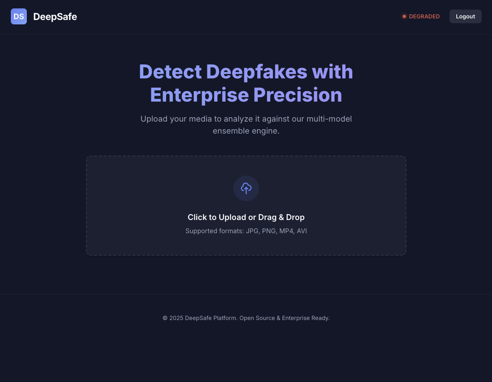
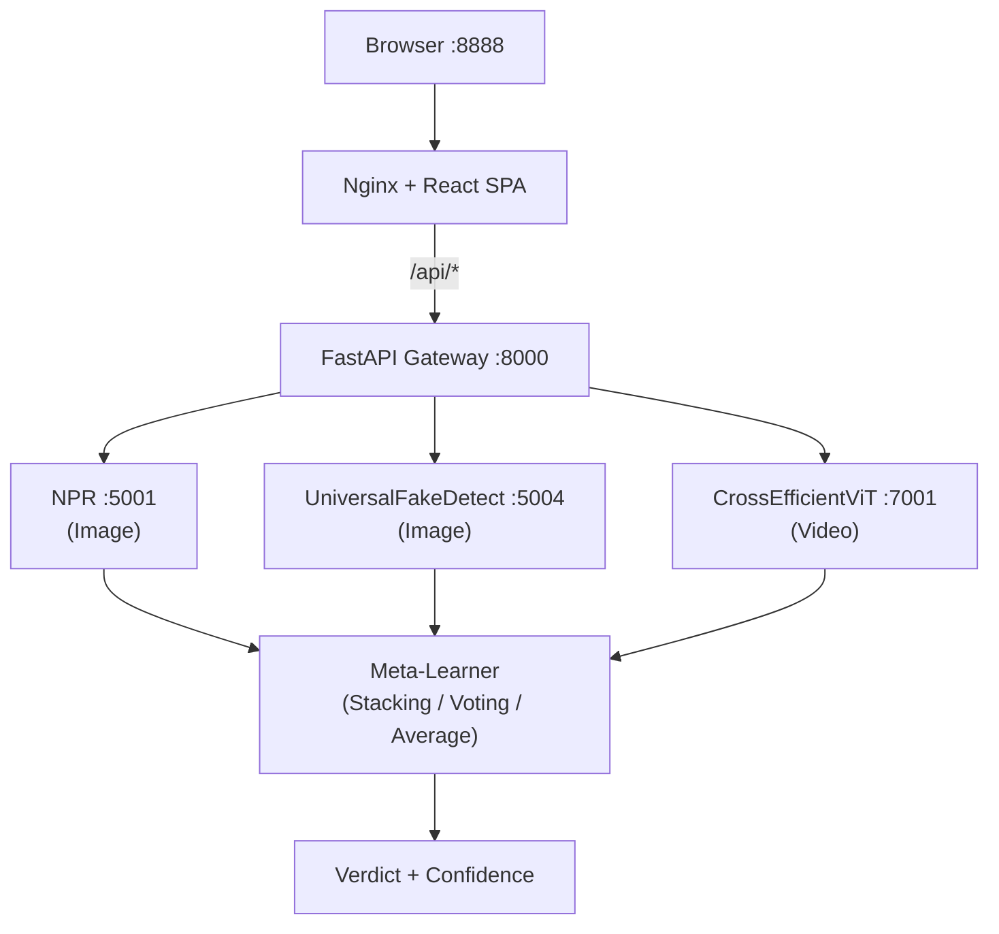
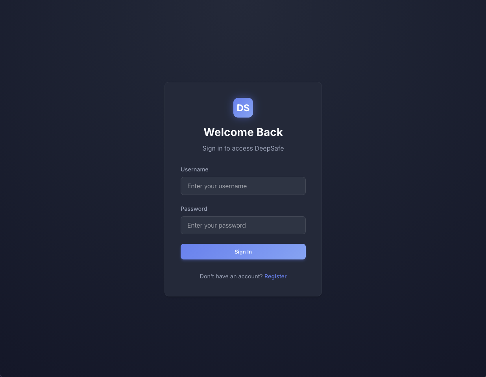
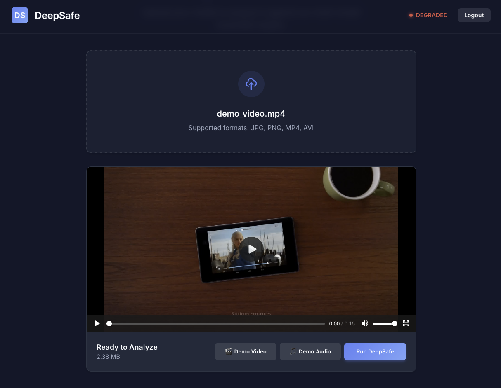
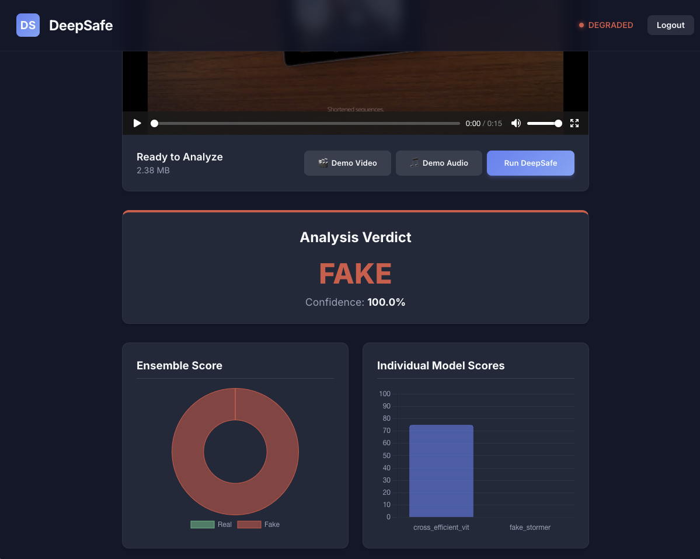

# sofia-forensics

> **Fork of [DeepSafe](https://github.com/siddharthksah/DeepSafe) for master's thesis research at the University of Bari Aldo Moro.**

This repository is a personalized fork of the DeepSafe deepfake detection
platform, extended with OSINT modules and a SOFIA layer mapper for the
purpose of master's thesis research on cyber-social terrorism, conducted
under the supervision of Prof.ssa Barletta at the SERLAB research group.

The thesis builds on the **SOFIA framework** (Baldassarre et al.), a
multi-layered model for analyzing AI-driven cyber-social threats. This
fork operationalizes the framework's "Layer 2 Shield" component for
retroactive provenance reconstruction of deepfake artifacts, when proactive
watermarking is absent.

## Original contribution vs inherited base

| Component | Origin |
|---|---|
| API gateway (FastAPI), microservices architecture, meta-learner stacking | Inherited from DeepSafe (MIT) |
| Image and video deepfake detectors (NPR, UniFD, Cross-Efficient ViT) | Inherited from DeepSafe |
| `models/osint/` modules (ingestion, metadata forensics, reverse search, first appearance) | Original thesis work |
| `api/sofia/` SOFIA layer mapper | Original thesis work |
| Audio and text detectors | Original thesis work (planned) |

Architecture decision records documenting design choices made during this
fork are maintained in a separate private repository for the duration of
the thesis work, and may be made available upon request for academic
evaluation purposes.

## Original DeepSafe README

The original DeepSafe README follows below, preserved for reference and
attribution.

---

# DeepSafe

**Enterprise-grade deepfake detection across image, video, and audio.**

[](https://github.com/siddharthksah/DeepSafe/actions)
[](https://opensource.org/licenses/MIT)
[](https://www.python.org/downloads/)
[](https://www.docker.com/)
[](https://huggingface.co/datasets/siddharthksah/DeepSafe-benchmark)
[](https://huggingface.co/siddharthksah/deepsafe-weights)

DeepSafe is a modular platform that combines multiple state-of-the-art deepfake detection models into a single ensemble system. Each model runs in its own Docker container. A central API gateway orchestrates requests, dispatches them to model services, and fuses results using voting, averaging, or a trained stacking meta-learner.

**Add a new model in minutes, retrain the ensemble in one command.**

<div align="center">
  
</div>

---

## Architecture


```mermaid
graph TD
    Browser["Browser :8888"] --> Nginx["Nginx + React SPA"]
    Nginx -->|"/api/*"| Gateway["FastAPI Gateway :8000"]

    Gateway --> NPR["NPR :5001<br/>(Image)"]
    Gateway --> UFD["UniversalFakeDetect :5004<br/>(Image)"]
    Gateway --> CEV["CrossEfficientViT :7001<br/>(Video)"]

    NPR --> Ensemble["Meta-Learner<br/>(Stacking / Voting / Average)"]
    UFD --> Ensemble
    CEV --> Ensemble

    Ensemble --> Verdict["Verdict + Confidence"]
```

Every model container exposes two endpoints: `GET /health` and `POST /predict`. The gateway reads model registrations from a single config file and handles the rest.

---

## Quick Start

```bash
git clone https://github.com/siddharthksah/DeepSafe.git
cd DeepSafe
make start
```

| URL | Description |
|-----|-------------|
| http://localhost:8888 | Web dashboard |
| http://localhost:8000/docs | API documentation (Swagger) |

---

## Active Models

| Model | Type | Port | Description | Source |
|-------|------|------|-------------|--------|
| **NPR Deepfake** | Image | 5001 | Neural Pattern Recognition for subtle artifact detection | [Paper](https://arxiv.org/abs/2310.14036) / [GitHub](https://github.com/chuangchuangtan/NPR-DeepfakeDetection) |
| **UniversalFakeDetect** | Image | 5004 | CLIP-based detector that generalizes across generators | [Paper](https://arxiv.org/abs/2302.10174) / [GitHub](https://github.com/WisconsinAIVision/UniversalFakeDetect) |
| **Cross-Efficient ViT** | Video | 7001 | EfficientNet + Vision Transformer for video analysis | [Paper](https://arxiv.org/abs/2107.02612) / [GitHub](https://github.com/davide-coccomini/Combining-EfficientNet-and-Vision-Transformers-for-Video-Deepfake-Detection) |

All model weights are mirrored on [HuggingFace](https://huggingface.co/siddharthksah/deepsafe-weights) for resilience.

---

## Ensemble Methods

The API gateway supports three fusion strategies:

| Method | How it works |
|--------|-------------|
| **Voting** | Majority vote across model predictions |
| **Average** | Mean of model probability scores |
| **Stacking** | Trained meta-learner (LightGBM/XGBoost/etc.) on model outputs |

Stacking uses pre-trained artifacts in `api/meta_model_artifacts/`. Retrain anytime with `make retrain MEDIA_TYPE=image`.

---

## Adding a New Model

DeepSafe ships with an SDK that handles HTTP serving, health checks, lazy loading, and thread safety. You write only the inference logic.

### Automated

```bash
# Register model (updates config + compose + creates scaffold)
make add-model NAME=my_detector MEDIA_TYPE=image PORT=5008

# Implement your logic in models/image/my_detector/detector.py

# Build, start, and retrain ensemble
make start
make retrain MEDIA_TYPE=image
```

### What you write

```python
# models/image/my_detector/detector.py
import torch
from deepsafe_sdk import ImageModel, PredictionResult

class MyDetector(ImageModel):
    def load(self):
        self.model = torch.load(self.weights_path("weights/model.pth"))
        self.model.eval()

    def predict(self, input_data: str, threshold: float) -> PredictionResult:
        image = self.decode_image(input_data)
        prob = self.run_inference(image)
        return self.make_result(probability=prob, threshold=threshold)
```

See [docs/adding-a-model.md](docs/adding-a-model.md) for the full guide.

---

## Retraining the Ensemble

After adding or removing models, retrain the stacking meta-learner:

```bash
# Full pipeline: run inference on benchmark dataset + train meta-learner
make retrain MEDIA_TYPE=image

# With Optuna hyperparameter search
make retrain MEDIA_TYPE=image OPTIMIZER=optuna TRIALS=100

# Re-train from existing features (skip inference)
make eval MEDIA_TYPE=image
```

The pipeline health-checks all active models, generates a feature matrix from the [benchmark dataset](https://huggingface.co/datasets/siddharthksah/DeepSafe-benchmark), trains 8 classifiers (LogReg, RF, GBM, SVM, KNN, NB, XGBoost, LightGBM), and deploys the best performer.

---

## Benchmark Dataset

A balanced multi-modal benchmark is available on [HuggingFace](https://huggingface.co/datasets/siddharthksah/DeepSafe-benchmark):

| Modality | Real | Fake | Total | Generators |
|----------|------|------|-------|------------|
| Images | 2,000 | 2,000 | 4,000 | DALL-E 2/3, Midjourney v5/6/7, Stable Diffusion 1.x/2/3/XL, Flux, GPT Image, Grok, Imagen 3/4, and 20+ more |
| Audio | 1,000 | 1,000 | 2,000 | HiFiGAN, MelGAN, WaveGlow, Tacotron, ASVspoof attacks, Neural Codec, and 20+ more |
| Video | 100 | 100 | 200 | Sora, Gen-2, Moonvalley, LaVie, ModelScope, LAVDF manipulations, and 10+ more |

---

## API Reference

### Predict (JSON)

```bash
curl -X POST http://localhost:8000/predict \
  -H "Content-Type: application/json" \
  -d '{"media_type": "image", "image_data": "<base64>", "ensemble_method": "voting"}'
```

### Detect (File Upload)

```bash
curl -X POST http://localhost:8000/detect \
  -F "file=@photo.jpg" \
  -F "ensemble_method=stacking"
```

### Response

```json
{
  "verdict": "fake",
  "confidence_in_verdict": 0.92,
  "ensemble_score_is_fake": 0.92,
  "ensemble_method_used": "stacking",
  "model_results": {
    "npr_deepfakedetection": {"probability": 1.0, "class": "fake"},
    "universalfakedetect": {"probability": 0.85, "class": "fake"}
  }
}
```

### Auth

```bash
# Register
curl -X POST http://localhost:8000/register -d "username=user&password=pass"

# Login (returns JWT)
curl -X POST http://localhost:8000/token -d "username=user&password=pass"

# Use token for protected endpoints (/history, /users/me)
curl -H "Authorization: Bearer <token>" http://localhost:8000/history
```

---

## Commands

```bash
make help          # Show all commands
make start         # Start all services
make stop          # Stop all services
make health        # Check model service health
make test          # Run system tests
make lint          # Run linters (black + flake8)
make add-model     # Register a new model
make retrain       # Retrain ensemble meta-learner
make eval          # Re-train from existing features
make clean         # Remove containers and caches
```

---

## Project Structure

```
DeepSafe/
├── api/                        # FastAPI gateway
│   ├── main.py                 # API routes, ensemble logic, auth
│   ├── database.py             # SQLAlchemy models (analysis history)
│   └── meta_model_artifacts/   # Deployed meta-learner weights
├── sdk/                        # Model SDK (shared base classes)
│   └── deepsafe_sdk/           # ImageModel, VideoModel, AudioModel
├── models/
│   ├── image/
│   │   ├── npr_deepfakedetection/
│   │   └── universalfakedetect/
│   └── video/
│       └── cross_efficient_vit/
├── frontend/                   # React + Tailwind dashboard
├── config/
│   └── deepsafe_config.json    # Model registry
├── scripts/
│   ├── add_model.py            # Model integration CLI
│   ├── retrain_pipeline.py     # Ensemble retraining pipeline
│   └── health_check.py         # Service health checker
├── meta_feature_generator.py   # Meta-feature dataset builder
├── train_meta_learner_advanced.py  # Meta-learner training suite
├── docker-compose.yml
└── Makefile
```

---

## UI Preview

<div align="center">
  
  
  
</div>

---

## Contributing

We welcome contributions. See [CONTRIBUTING.md](CONTRIBUTING.md) and [Code of Conduct](CODE_OF_CONDUCT.md).

The easiest way to contribute is adding a new detection model. See [docs/adding-a-model.md](docs/adding-a-model.md).

---

## License

MIT License. See [LICENSE](LICENSE).

---

## Credits

DeepSafe integrates the following open-source research:

- **NPR Deepfake**: Chuangchuang Tan et al. ([GitHub](https://github.com/chuangchuangtan/NPR-DeepfakeDetection))
- **UniversalFakeDetect**: Utkarsh Ojha, Yuheng Li, Yong Jae Lee ([GitHub](https://github.com/WisconsinAIVision/UniversalFakeDetect))
- **Cross-Efficient ViT**: Davide Coccomini et al. ([GitHub](https://github.com/davide-coccomini/Combining-EfficientNet-and-Vision-Transformers-for-Video-Deepfake-Detection))
- **CLIP**: Alec Radford et al., OpenAI ([GitHub](https://github.com/openai/CLIP))

## Citation

```bibtex
@misc{deepsafe,
  author = {Siddharth Kumar},
  title = {DeepSafe: Enterprise-Grade Deepfake Detection Platform},
  year = {2025},
  publisher = {GitHub},
  url = {https://github.com/siddharthksah/DeepSafe}
}
```
